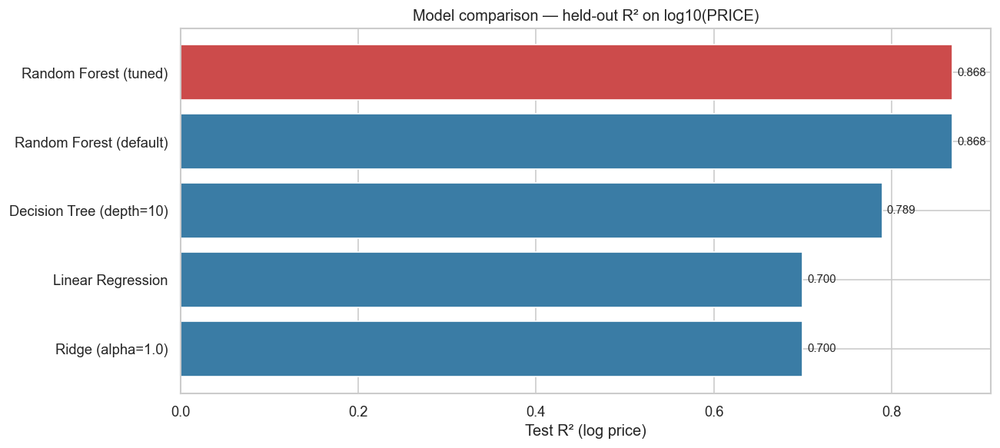
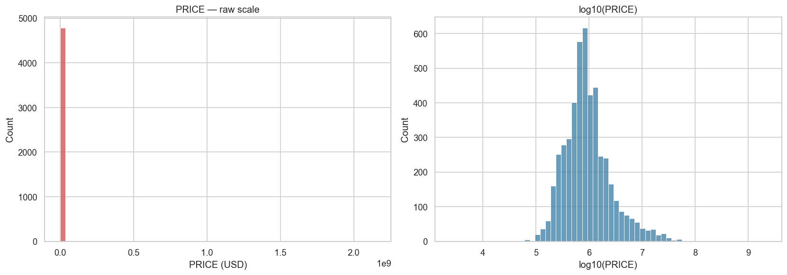
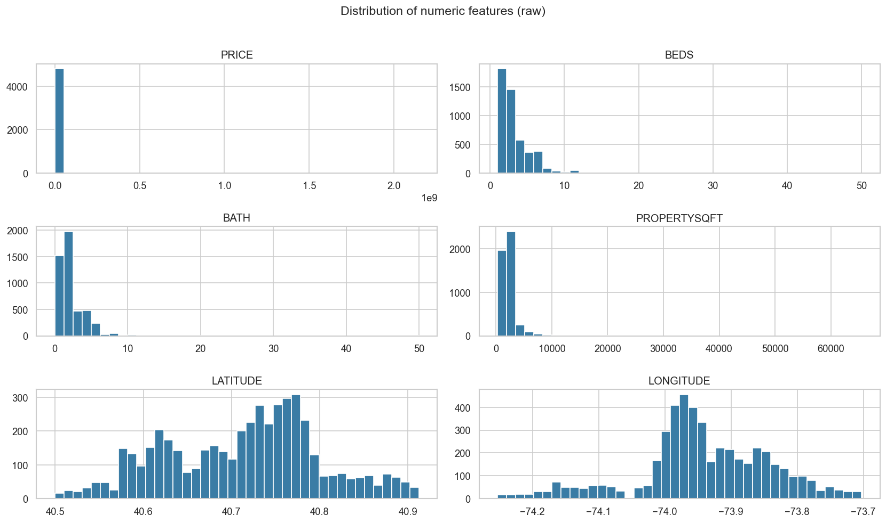
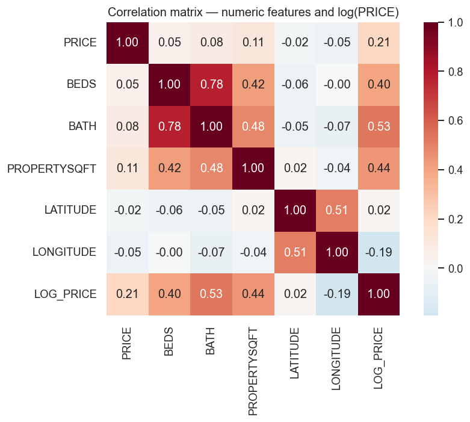
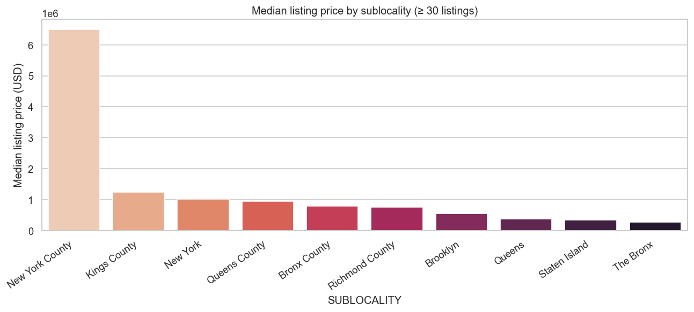
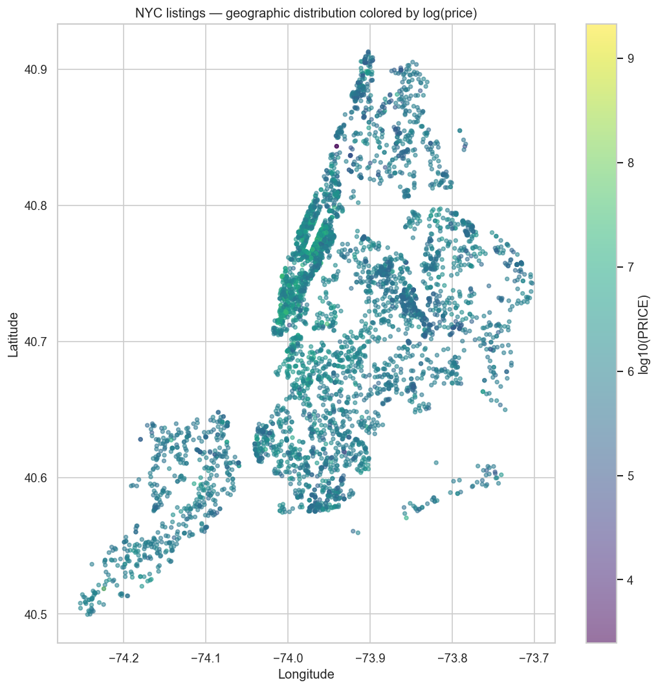
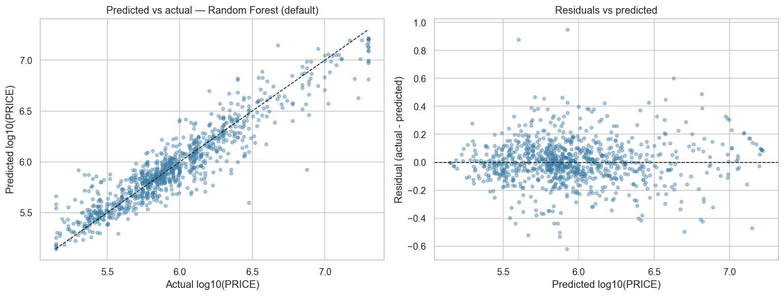
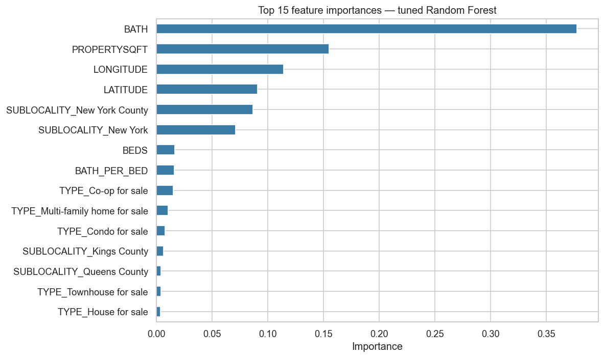
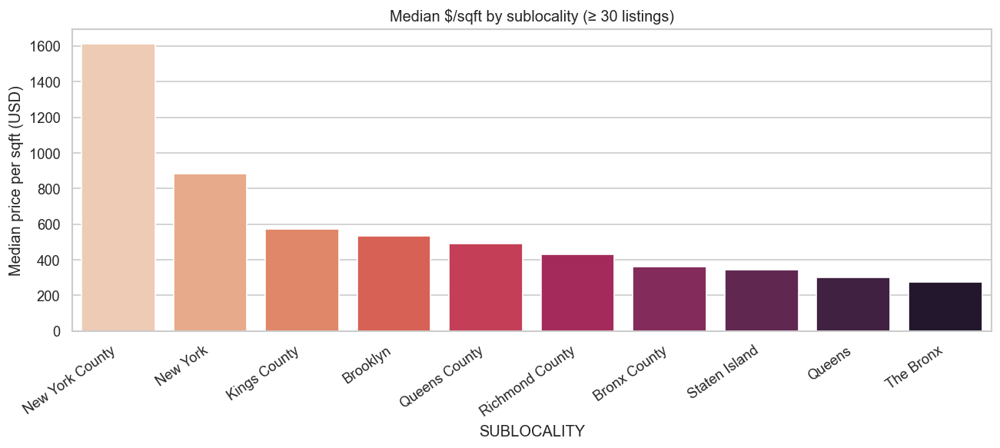

# Predicting New York City Home Listing Prices

> A regression-modeling project on 4,801 active NYC listings that predicts
> log-price within an 18% median dollar margin and surfaces what actually drives
> the city's residential market.

## Documents

- 📄 [Final Report (PDF)](reports/final_report.pdf)
- 📄 [Final Report (Markdown)](reports/final_report.md)

## Notebooks

###  EDA
- 📓 Git Repo [01 — Exploratory Data Analysis](notebooks/01_eda.ipynb)
- 📓 Google Colab https://drive.google.com/file/d/14YCOLWivrK3hQJaf0H9gOyJgP2JBvXCf/view?usp=sharing

### Preprocessing & Modeling 
- 📓 Git Repo [02 — Preprocessing & Modeling](notebooks/02_preprocessing_and_modeling.ipynb)
- 📓 Google Colab https://drive.google.com/file/d/1K6qWVB9ynmmW0OYelCSvQHW2Wz0JbWSt/view?usp=sharing

### Insights and Ethics
- 📓 Git Repo [03 — Insights & Ethics](notebooks/03_insights_and_ethics.ipynb)
- 📓 Google Colab https://drive.google.com/file/d/116gh4qCGB1nI3Ta-oi8ZiBMZcie-cnww/view?usp=sharing

## Overview

New York City's residential market spans six orders of magnitude in price and
five very different boroughs. Pricing a listing well is hard, and pricing it
*consistently* across an entire brokerage is harder still. This project builds
a predictive model from a public Kaggle dataset to give a brokerage analyst an
automated first-pass screen for new listings — not as a replacement for human
judgment, but as a triage tool that flags the listings most worth a second
look.

After dropping duplicates and obvious data-entry errors (4,801 → 3,961 rows),
I compared four models from the course toolkit on a held-out 20% test set:
**Linear Regression**, **Ridge**, **Decision Tree**, and a **tuned Random
Forest**. The Random Forest wins on every metric: **R² = 0.868** on
log10(PRICE) and a **median dollar error of 18.5%**.

## Headline Result



## What the Data Looks Like

The target is heavily right-skewed across six orders of magnitude, which is why
the modeling stage uses `log10(PRICE)`:



Numeric features are dominated by sharp low-integer modes for `BEDS`/`BATH` and
a giveaway spike at the column mean for `PROPERTYSQFT` (upstream
mean-imputation):



`PROPERTYSQFT`, `BATH`, and `BEDS` are the strongest numeric correlates of
log-price; latitude is non-monotonic because the city has multiple high-price
zones at different latitudes:



Median listing price varies sharply by sublocality, with Manhattan-area
sublocalities sitting roughly an order of magnitude above Staten Island and
the Bronx:



The same pattern holds at the listing level: the geographic scatter of every
listing colored by log-price shows clear bright clusters in Manhattan and dim
clusters in Staten Island and the eastern Bronx:



## Business Questions Answered

- **Which property attributes drive price most?** Bathrooms (38%), property
  square footage (15%), and Manhattan-borough membership (~16% combined). A
  surprise: bedrooms rank low because they are tightly correlated with
  bathrooms, and the random forest consistently prefers bathrooms as the
  splitter.
- **Can we predict price accurately enough to be useful?** Yes — within ~18%
  of true price for the typical listing, but with noisy errors above $5M.
  Useful as a mispricing flag, not as a substitute for an appraiser.
- **Where is the best dollar-per-square-foot value?** Queens and the Bronx,
  by 2–3× over Manhattan, with Brooklyn in the middle.

## Repo Structure

```
data_science_project_housing_project/
├── CLAUDE.md                      # Project guidance for Claude Code
├── README.md                      # This file
├── project_deliverables.md        # The 7 project steps
├── report_requirements.md         # The 9 report sections
├── data/
│   └── NY-House-Dataset.csv       # Source dataset (Kaggle)
├── notebooks/
│   ├── 01_eda.ipynb               # EDA + business questions
│   ├── 02_preprocessing_and_modeling.ipynb   # Cleaning, modeling, tuning
│   └── 03_insights_and_ethics.ipynb          # Answers + ethics reflection
├── figures/                       # PNG exports embedded in report and README
├── reports/
│   ├── final_report.md            # Submission-ready markdown report
│   └── final_report.pdf           # Rendered PDF
├── Lecture Notes/                 # Course material (modules 0–7 + textbook)
└── .claude/skills/                # Skills that orchestrate the deliverables
```

## Dataset

- **Source.** [New York Housing Market](https://www.kaggle.com/datasets/nelgiriyewithana/new-york-housing-market) by Nidula Elgiriyewithana on Kaggle.
- **Size.** 4,801 rows × 17 columns.
- **Target.** `PRICE` (continuous, USD). Modeled as `log10(PRICE)`.
- **Coverage.** All five NYC boroughs; snapshot rather than time series.

## Approach

1. **EDA** — distributions, correlations, geographic scatter, data-quality scan.
2. **Cleaning** — drop duplicates, drop bogus values, cap PRICE at 1st/99th percentile.
3. **Feature engineering** — `BATH_PER_BED`, low-frequency category bucketing, log-target.
4. **Pipeline** — `ColumnTransformer` with `StandardScaler` + `OneHotEncoder`, leak-free.
5. **Models** — Linear Regression, Ridge, Decision Tree, Random Forest.
6. **Tuning** — `GridSearchCV` over the Random Forest with 5-fold CV.
7. **Evaluation** — RMSE, MAE, R², plus a translated median-percentage-error on the dollar scale.

## Results

| Model | RMSE (log) | MAE (log) | **R²** | RMSE (USD) | MAE (USD) | Median % err | CV R² |
|---|---|---|---|---|---|---|---|
| **Random Forest (tuned)** | **0.158** | **0.113** | **0.868** | **$1,396,982** | **$517,560** | **18.5%** | **0.836** |
| Random Forest (default) | 0.158 | 0.113 | 0.868 | $1,396,982 | $517,560 | 18.5% | 0.836 |
| Decision Tree (depth=10) | 0.200 | 0.144 | 0.790 | $1,736,645 | $666,651 | 24.8% | 0.737 |
| Linear Regression | 0.239 | 0.176 | 0.700 | $3,876,452 | $988,527 | 30.5% | 0.674 |
| Ridge (alpha=1.0) | 0.239 | 0.177 | 0.700 | $3,870,656 | $988,787 | 30.6% | 0.675 |

The Random Forest beats Linear Regression by 17 R² points and cuts the median
dollar error nearly in half. The grid search found no configuration meaningfully
better than the scikit-learn defaults within the explored grid, so the tuned
and default Random Forest report identical numbers.





For buyers comparing boroughs on a per-square-foot basis, Queens and the Bronx
deliver substantially more space per dollar than Manhattan or Brooklyn:



## Reproducing the Project

```bash
# 1. Install dependencies
pip install pandas numpy scikit-learn matplotlib seaborn jupyter nbformat markdown-pdf

# 2. Place the dataset in data/  (NY-House-Dataset.csv)
```


## Ethics

Geography is a strong proxy for demographics in NYC. A model trained on
historical listing prices will reproduce any historical inequities those
prices encode, so any deployment should keep a human in the loop, monitor
borough-level error for fairness drift, and run a formal fairness audit before
the model is allowed to *set* prices in protected neighborhoods. The full
discussion is in [Section 7 of the final report](reports/final_report.md#7-ethics--responsible-ai).

## Acknowledgments

- **Course:** Introductory Data Science — modules 0–7
- **Textbook:** *Introduction to Machine Learning with Python* (Müller & Guido)
- **Dataset:** Nidula Elgiriyewithana, New York Housing Market, Kaggle 2024
- Drafted with assistance from Claude Code; final analysis, code review, and writing decisions are the author's.
