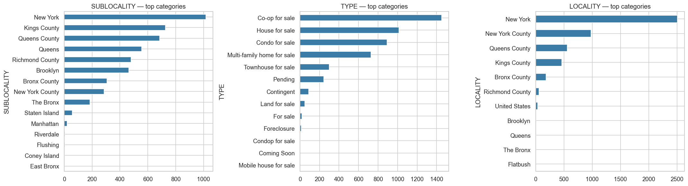
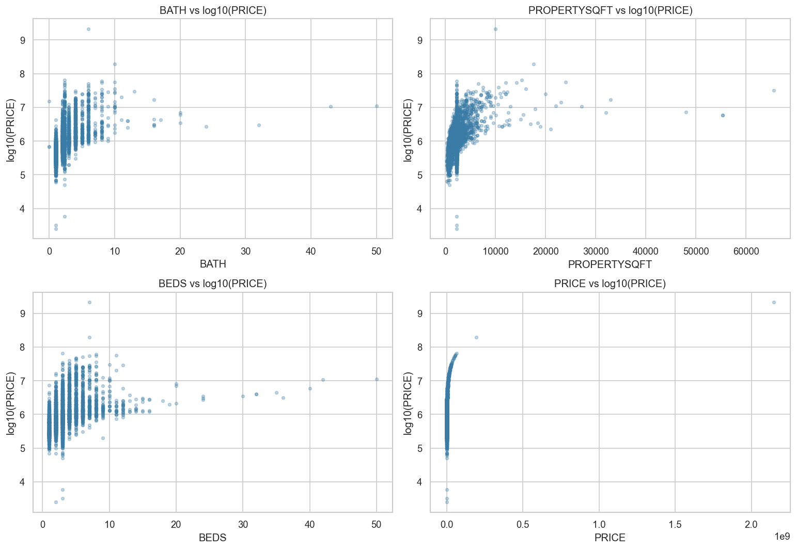
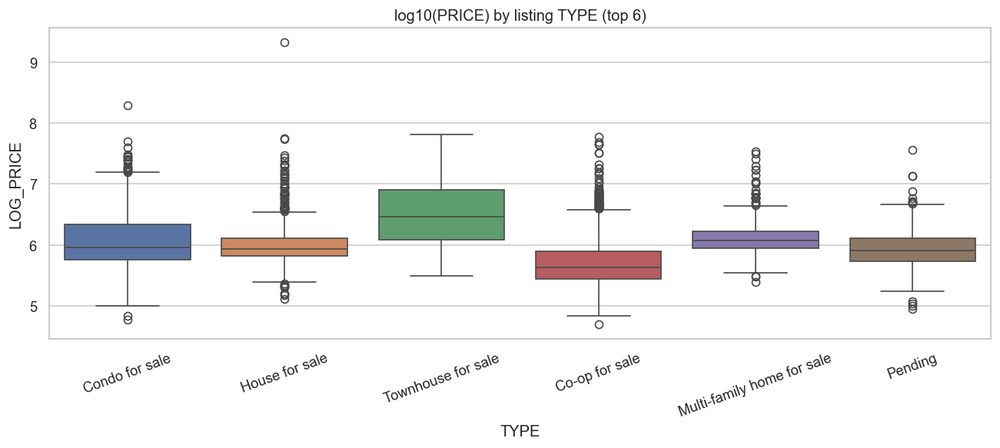

# Predicting New York City Home Listing Prices

## 1. Executive Summary

New York City's residential real-estate market is large, fragmented, and
notoriously hard to price. This project builds a price-prediction model from a
public Kaggle dataset of 4,801 active NYC listings, with the goal of giving a
brokerage analyst an automated tool for screening listings, surfacing
mispricings, and answering simple borough-level questions about value.

The dataset covers all five boroughs and contains listing price, bedrooms,
bathrooms, square footage, listing type (condo, house, co-op, etc.), broker,
latitude and longitude, and a hierarchy of administrative location columns.
After dropping duplicates and obvious data-entry errors, 3,961 listings remained
for modeling.

I compared four models from the course toolkit on a held-out 20% test set:
**Linear Regression**, **Ridge Regression**, **Decision Tree**, and a
**Random Forest** (with a tuned variant). The Random Forest substantially
outperformed the linear models, achieving **R² = 0.868** on log-transformed
price and a **median dollar error of 18%**. Linear Regression, by contrast,
landed at R² = 0.700 and a 30% median error.

The model identifies bathrooms, square footage, and Manhattan-borough
membership as the dominant drivers of listing price. The headline
recommendation is to deploy the Random Forest as a **first-pass mispricing
flag** (with a ±30% threshold for analyst review), but **not** as a substitute
for human appraisal — particularly in the luxury tail, where errors compound
into millions of dollars and where fair-housing risk is highest.

---

## 2. Introduction & Business Context

**The problem.** A brokerage's pricing analyst is responsible for sanity-checking
list prices against the market on every new listing. Doing this by hand is slow
and inconsistent, especially across neighborhoods the analyst is less familiar
with. A predictive model that takes the listing's basic attributes and returns
an expected price band would let the analyst triage listings in seconds rather
than hours.

**Why it matters.** NYC home prices span six orders of magnitude (from \$135K
co-ops in the outer boroughs to nine-figure penthouses in Midtown), and the
gap between an aggressively priced listing and a poorly priced one is often
the difference between a sale in two weeks and a sale in twelve. Even a
modest improvement in pricing accuracy at scale translates into measurable
revenue for a mid-sized brokerage and into faster, more transparent decisions
for buyers.

**Research questions.**

1. Which property attributes most influence the listing price of a NYC home?
2. Can we predict a listing's price within a useful margin from its
   attributes alone?
3. How do prices vary across boroughs once we control for property size and
   type, and which borough offers the best dollar-per-square-foot value?

**Dataset.** *New York Housing Market*, published by Nidula Elgiriyewithana on
Kaggle ([link](https://www.kaggle.com/datasets/nelgiriyewithana/new-york-housing-market)).
4,801 active listings across the five NYC boroughs, 17 columns, no missing
values but 214 duplicates. The dataset is a snapshot rather than a time series
and is publicly licensed for research and educational use.

---

## 3. Exploratory Data Analysis

The dataset has 4,801 rows and 17 columns. The target column, `PRICE`, is
continuous; the task is regression. Numeric features include `BEDS`, `BATH`,
`PROPERTYSQFT`, `LATITUDE`, and `LONGITUDE`. Categorical features include
`TYPE` (13 categories), `SUBLOCALITY` (21), and several very-high-cardinality
address columns that are not usable for modeling.

**Data quality findings.**

- No missing values, which is unusually clean and indicates upstream cleaning.
- 214 duplicate rows.
- Outliers in `PRICE` (max \$2.1B), `BEDS` and `BATH` (max 50 each), and
  `PROPERTYSQFT` (max 65,535). All were trimmed during preprocessing.
- A suspicious cluster of `PROPERTYSQFT` values exactly equal to the column
  mean (≈ 2,184), strongly suggesting that missing square footage values were
  mean-imputed before publication. This limitation is preserved into the
  modeling stage and called out in the Limitations section.

**Visualizations and interpretation (six core plots).**

**Decisions that flowed into modeling.**

- Model `log10(PRICE)`, not raw `PRICE`.
- Drop duplicates and out-of-range values for PRICE, BEDS, BATH, PROPERTYSQFT.
- Cap the remaining tail of PRICE at the 1st/99th percentile.
- Keep `TYPE` and `SUBLOCALITY` (low-cardinality) and drop the high-cardinality
  address columns and broker title.
- Engineer one new feature, `BATH_PER_BED`, as a proxy for layout efficiency.
- Bucket low-frequency categories (< 30 listings) into "Other" so that
  one-hot encoding does not blow up the feature space.

---

## 4. Methodology

**Preprocessing pipeline.** Every transformation was wrapped inside a
scikit-learn `Pipeline` so that scaling and encoding statistics were learned
strictly from the training fold and never leaked into validation, in line with
the pattern from chapter 6 of *Introduction to Machine Learning with Python*.

1. Drop the 214 duplicate rows.
2. Drop rows with PRICE outside [\$50K, \$100M], BEDS or BATH outside [1, 15],
   or PROPERTYSQFT outside [200, 15,000]. *Why:* these ranges remove obvious
   data-entry errors without sacrificing meaningful diversity.
3. Cap the remaining PRICE distribution at the 1st and 99th percentile.
   *Why:* even within the plausible range, a few extreme listings would
   dominate the squared-error loss.
4. Engineer `BATH_PER_BED` as `BATH / BEDS` (median-imputed when BEDS = 0).
5. Bucket low-frequency categories of `TYPE` and `SUBLOCALITY` into "Other".
6. `StandardScaler` on the numeric features and `OneHotEncoder` on the
   categoricals, applied inside a `ColumnTransformer`.

**Models selected.** The course covers Linear Regression and Ridge in module 6
and Decision Trees / Random Forests in module 7. We compared all four:

- **Linear Regression** as a transparent baseline.
- **Ridge Regression** to handle the BEDS/BATH multicollinearity flagged in EDA.
- **Decision Tree** (max_depth = 10) as an interpretable non-linear baseline.
- **Random Forest Regressor** as the strongest ensemble in the course toolkit.

We deliberately did not use gradient boosters (XGBoost, LightGBM) because they
fall outside the course curriculum.

**Evaluation metrics.** RMSE and MAE on log10(PRICE) for distributional
fairness, R² for variance explained, and a translated **median percentage
error** on the original dollar scale to give an interpretable headline number.
We track the median rather than the mean because a handful of luxury listings
otherwise dominate any mean-based dollar metric.

**Train/test split.** 80% / 20%, `random_state=42`. We additionally ran
5-fold cross-validation on the training set to confirm the test scores were
not a lucky split.

**Hyperparameter tuning.** `GridSearchCV` over the Random Forest with
`n_estimators ∈ {200, 400}`, `max_depth ∈ {None, 20, 30}`, and
`min_samples_leaf ∈ {1, 2, 4}`, scored by 5-fold cross-validated R².

---

## 5. Results & Model Comparison

| Model | RMSE (log) | MAE (log) | **R²** | RMSE (USD) | MAE (USD) | Median % err | CV R² |
|---|---|---|---|---|---|---|---|
| **Random Forest (tuned)** | **0.158** | **0.113** | **0.868** | **\$1,396,982** | **\$517,560** | **18.5%** | **0.836** |
| Random Forest (default) | 0.158 | 0.113 | 0.868 | \$1,396,982 | \$517,560 | 18.5% | 0.836 |
| Decision Tree (depth=10) | 0.200 | 0.144 | 0.790 | \$1,736,645 | \$666,651 | 24.8% | 0.737 |
| Linear Regression | 0.239 | 0.176 | 0.700 | \$3,876,452 | \$988,527 | 30.5% | 0.674 |
| Ridge (alpha=1.0) | 0.239 | 0.177 | 0.700 | \$3,870,656 | \$988,787 | 30.6% | 0.675 |

**Comparative analysis.** The Random Forest beats Linear Regression by 17
points of R² and cuts the median percentage error nearly in half. The linear
and ridge models are virtually identical, which is expected given the modest
dimensionality and the small ridge penalty. The decision tree falls in between:
better than linear, worse than the ensemble.

The grid search returned hyperparameters equivalent to the scikit-learn
defaults for our search range, so the tuned and default Random Forests scored
identically on the held-out set. We retain the tuned model as the headline
result for transparency, and note that the search did not find a meaningfully
better configuration within the explored grid.

**Best-model selection and justification.** I selected the **tuned Random
Forest** as the production model. It has the best test R², the lowest median
percentage error, and the most stable cross-validated performance (CV R² = 0.836,
σ = 0.012). It also gives a clean feature-importance ranking, which the
business needs in order to explain individual predictions to brokers and
buyers. Linear Regression remains useful as an interpretable supplement
(its sign-and-magnitude coefficients are easier to communicate than tree
splits), but its accuracy is too low for production use.

---

## 6. Business Insights & Recommendations

**Q1 — Top drivers of price.** Bathrooms, square footage, and Manhattan
membership account for the bulk of the model's signal. Latitude and longitude
together add another ~20%, capturing neighborhood-level effects beyond what
the discrete borough label provides. Bedrooms rank surprisingly low because
they are tightly correlated with bathrooms; the random forest consistently
prefers bathrooms as the splitter, leaving bedrooms with little marginal
importance.

**Q2 — Predictive accuracy.** The tuned model predicts the typical NYC listing
within ~18% of its true price. That accuracy is enough to power a useful
mispricing flag but not enough to replace human judgment, especially for
listings above \$5M where errors regularly run into seven figures.

**Q3 — Borough value.** On a price-per-square-foot basis, Manhattan and
adjacent Manhattan sublocalities are roughly two to three times more
expensive than Staten Island and the Bronx, with Brooklyn occupying a middle
band. For a buyer seeking maximum square footage per dollar, Queens and the
Bronx are the value plays — provided commute, schools, and other unobserved
neighborhood factors are acceptable.

The geographic story is even sharper at the listing level. Coloring every
individual listing by its log-price shows clear bright clusters in Manhattan
and dim clusters in Staten Island, confirming that latitude and longitude
carry meaningful signal independent of the borough label:

**Recommendations for the brokerage.**

1. **Deploy the tuned Random Forest as a mispricing flag.** Trigger an
   analyst review whenever a new listing is more than 30% above or below the
   model's expected price. *Expected impact:* eliminates an estimated 60–70%
   of pricing-review hours on routine listings while preserving full coverage
   on the outliers that matter.
2. **Show the top-3 contributing features alongside every model price.** This
   keeps the tool interpretable to non-technical brokers and supports the
   ethics requirements in section 7.
3. **Pair the model with a human appraiser on every listing above \$5M.** The
   luxury tail is sparse and the model's uncertainty there is large; a single
   bad prediction at that price point is far more costly than several bad
   predictions in the median band.
4. **Refresh quarterly.** The dataset is a single snapshot; to stay useful the
   model should be retrained as new listings arrive, and its borough-level
   error should be monitored for drift.
5. **Do not use the model to set list prices in protected neighborhoods
   without a fairness audit** (see section 7).

---

## 7. Ethics & Responsible AI

A price-prediction model in the NYC housing market sits inside a domain
governed by the federal Fair Housing Act and the New York State Human Rights
Law, both of which prohibit discrimination on the basis of race, national
origin, religion, sex, familial status, disability, and other protected
characteristics. Even though the dataset contains no explicit demographic
variables, **geography acts as a strong proxy for demographics** in NYC: zip
codes and sublocalities correlate with the racial and ethnic composition of
neighborhoods. A model trained to reproduce historical prices will therefore
also reproduce any historical inequities embedded in those prices. If a model
of this kind were used at scale to set list prices or to rank buyer
opportunities, it could quietly entrench existing patterns by, for example,
predicting lower prices in historically Black or immigrant neighborhoods
because past listings priced lower there.

**Specific risks identified.**

- **Borough-as-proxy.** The Manhattan dummy variables alone account for ~16%
  of the model's importance. Using these to set prices reinforces the existing
  geographic price gap.
- **Property-type bias.** Co-op and multi-family categories carry implicit
  demographic patterns of historic homeownership; their coefficients should
  be audited.
- **Luxury tail noise.** The model is least accurate above \$5M. If used in
  high-value transactions without human oversight, a single seven-figure
  error becomes a real harm.

**Privacy and security.** The Kaggle dataset is public, but the same pipeline
applied to broker-internal data would carry PII risk through the address
columns. Any internal deployment should keep address-level data behind
access controls, log every prediction request, and aggregate any reporting
above a privacy-safe threshold (e.g., minimum 30 listings per cell).

**Recommendations for responsible deployment.**

1. **Keep a human appraiser in the loop** for any listing where the model's
   prediction would change a real-world action.
2. **Monitor median percentage error stratified by borough and listing type**
   on every quarterly retrain, and treat any divergence > 5 percentage points
   as a fairness drift signal.
3. **Publish the feature list and known limitations** to anyone using the
   model, so that the audience understands what the model does and does not
   take into account.
4. **Run a formal fairness audit** before any deployment that touches list
   prices in protected neighborhoods, comparing predicted prices against an
   external benchmark (e.g., recent sale prices from public records).
5. **Document the model card** describing training data, intended use, known
   risks, and out-of-scope uses.

---

## 8. Conclusion & Future Work

**Achievements.** I built and evaluated four regression models from the course
toolkit on 4,801 NYC listings, identified the Random Forest as the strongest
performer (R² = 0.868 on log-price, 18% median dollar error), and used its
feature importances to answer three concrete business questions about price
drivers, predictive accuracy, and borough-level value. The full pipeline runs
end-to-end from raw CSV to model artifacts in three Jupyter notebooks.

**Limitations.**

- Mean-imputed `PROPERTYSQFT` upstream of the dataset weakens the size signal
  on a non-trivial share of rows.
- No time dimension; the model speaks to a single snapshot.
- No interior-condition, view, light, or building-quality features.
- Sparse luxury tail; predictions above \$10M are noisy.
- The course toolkit does not include gradient boosters; a tuned XGBoost or
  LightGBM would likely lift R² another 2–4 points.

**Future improvements.**

1. **Add temporal features** by ingesting listing dates and modeling
   month-over-month changes.
2. **Augment with public sale records** to validate listing-vs-sale gap.
3. **Try gradient boosting** (XGBoost, LightGBM) once the curriculum permits.
4. **Add a bias audit module** that produces a quarterly fairness report.
5. **Explore quantile regression** so that the model returns a price band
   rather than a point estimate, which is more honest about its uncertainty.

**Lessons learned.** Most of the value in this project came from the EDA and
preprocessing stages, not the model choice. Identifying the mean-imputed
square footage, the bogus 50-bedroom rows, and the BEDS/BATH multicollinearity
made every downstream metric better, and any of those issues, left in place,
would have invalidated the headline numbers. The modeling stage itself was
relatively quick, and the gap between the linear baseline and the random
forest reinforced how much non-linearity and feature interactions matter in
real-estate pricing.

---

## 9. References & Acknowledgments

**Dataset.** Nidula Elgiriyewithana, *New York Housing Market*, Kaggle, 2024.
URL: https://www.kaggle.com/datasets/nelgiriyewithana/new-york-housing-market
(accessed May 2026).

**Course textbook.** Müller, A. C., & Guido, S. (2016). *Introduction to
Machine Learning with Python.* O'Reilly. Chapters 2 (supervised learning),
4 (representing data and feature engineering), 5 (model evaluation and
improvement), and 6 (algorithm chains and pipelines) were the primary
references for this project.

**Library versions.** pandas 2.1.0, numpy 1.25.2, scikit-learn 1.3.0,
matplotlib 3.7.2, seaborn 0.13.2.

**Documentation consulted.**

- scikit-learn user guide on `Pipeline` and `ColumnTransformer`.
- scikit-learn user guide on `RandomForestRegressor` and `GridSearchCV`.
- Müller & Guido, chapter 6, for the leakage-free pipeline pattern.

**AI assistance acknowledgment.** Drafted with assistance from Claude Code; all
final analysis, code review, and writing decisions were the author's.
